<p align="center">
  
</p>

<h1 align="center">OpenWorkflows</h1>

<h3 align="center">Visual multi-model workflow editor for agent runtimes.</h3>

<p align="center">
  Build one Workflow graph, compile it into runnable scripts, and adapt it across Claude Code, Codex, Gemini, and future local or cloud model runtimes.
</p>

<p align="center">
  <strong>English</strong>
  &nbsp;·&nbsp;
  <a href="app/doc/README.zh-CN.md">中文</a>
  &nbsp;·&nbsp;
  <a href="app/doc/README.fr.md">Français</a>
  &nbsp;·&nbsp;
  <a href="app/doc/README.de.md">Deutsch</a>
  &nbsp;·&nbsp;
  <a href="app/doc/README.es.md">Español</a>
  &nbsp;·&nbsp;
  <a href="app/doc/README.pt-BR.md">Português</a>
  &nbsp;·&nbsp;
  <a href="app/doc/README.ru.md">Русский</a>
  &nbsp;·&nbsp;
  <a href="app/doc/README.ja.md">日本語</a>
  &nbsp;·&nbsp;
  <a href="app/doc/README.ko.md">한국어</a>
  &nbsp;·&nbsp;
  <a href="app/doc/README.hi.md">हिन्दी</a>
  &nbsp;·&nbsp;
  <a href="app/doc/README.ar.md">العربية</a>
  &nbsp;·&nbsp;
  <strong><a href="https://discord.gg/2C9ptSEFG">Discord</a></strong>
  &nbsp;·&nbsp;
  <strong>QQ Group: 149523963</strong>
</p>

<p align="center">
  <a href="app/package.json"></a>
  <a href="app/src-tauri/tauri.conf.json"></a>
  <a href="app/package.json"></a>
  <a href="app/package.json"></a>
  <a href="app/package.json"></a>
  <a href="https://discord.gg/2C9ptSEFG"></a>
  
</p>

<p align="center">
  
</p>

> [!IMPORTANT]
> **Community · 加入社区** — join the OpenWorkflows Discord or QQ group for setup help, workflow examples, feature ideas, and contributor coordination. Discord: <https://discord.gg/2C9ptSEFG> · QQ Group: `149523963`

## What OpenWorkflows Does

Claude Code introduced Workflow-style scripts for orchestrating multi-agent steps, parallel branches, and pipelines. OpenWorkflows turns that pattern into a visual editor with a portable intermediate representation, so the same graph can be edited, compiled, parsed, and adapted across different agent runtimes.

- Generate an editable Workflow blueprint from a natural-language goal.
- Author agent steps, parallel branches, pipelines, branches, loops, consensus nodes, and reusable composite workflows on a React Flow canvas.
- Compile the graph into runnable Claude Code-style Workflow scripts, then parse scripts back into the same graph model.
- Select runtime-facing adapters such as Claude Code, Codex, or Gemini, with per-node model and provider settings.
- Run or stop workflows from the desktop app while tracking node-level execution state.
- Keep workspaces, sessions, prompt shortcuts, API configuration, and local history on your machine.

## Quick Start

Run the web app from `app/`:

```bash
cd app
npm install
npm run dev
```

Vite starts at <http://localhost:5173>.

Run the desktop app:

```bash
cd app
npm run desktop
```

Build a production desktop package:

```bash
cd app
npm run package
```

From the repository root, `run.bat` rebuilds when needed and launches the Windows app. `build.bat` packages the Windows installer.

## Basic Usage

1. Create a workflow or open an existing session.
2. Describe the goal in the bottom-right AI input. OpenWorkflows generates an editable blueprint.
3. Refine the blueprint with follow-up instructions, or use the right-panel prompt shortcuts for structure, completeness, cost, reliability, and rollback-oriented edits.
4. Select nodes to edit prompts, model tiers, schemas, ports, or execution parameters.
5. Choose a runtime adapter such as Claude Code, Codex, or Gemini.
6. Click **Run** to execute the graph and watch per-node status updates.
7. Switch workspaces or sessions from the history rail to continue earlier work.

## CLI Preview

The CLI exposes two user-facing commands:

- `owf gen` generates or modifies a workflow script from natural language.
- `owf run` runs a workflow script, with dry-run and resume support.

Build it first if `app/cli/dist/owf.mjs` does not exist:

```bash
cd app
npm run cli:build
```

Then run it from the repository root:

```bash
node app/cli/dist/owf.mjs gen "Create a code-review workflow" -o review.js
node app/cli/dist/owf.mjs run review.js --dry-run
```

See [OpenWorkflows CLI usage](app/doc/openworkflows-cli-usage.md) and the [CLI skill spec](app/doc/openworkflows-cli-skill-spec.md) for details.

## Technology Stack

| Area | Technology |
| --- | --- |
| Desktop shell | Tauri 2, Rust |
| Frontend | React 18, Vite 5, TypeScript 5 |
| Canvas | React Flow / `@xyflow/react` |
| State | Zustand |
| Styling | Tailwind CSS, CSS variables |
| Icons | lucide-react |
| Workflow core | `IRGraph`, parser, emitter, round-trip checks |
| Runtime adapters | Claude Code, Codex, Gemini, extensible provider routing |

## Architecture

`IRGraph` is the single source of truth. The canvas, parser, emitter, AI mutation path, and runtime all operate on the same model-agnostic graph:

```text
Natural-language goal
        |
        v
AI blueprint generation  ->  IRGraph  ->  React Flow canvas
                                |
                                +----> emitter -> runnable Workflow script
                                |
                                +----> parser  -> round-trip graph recovery
                                |
                                +----> runtime -> Claude Code / Codex / Gemini
```

Core files:

```text
app/
  src/
    core/        IR, parser, emitter, fixtures, round-trip checks
    canvas/      React Flow projection, node components, toolbar
    panels/      Sidebar, prompt panel, AI dock, node inspector
    runtime/     DAG execution, provider gateway, run state
    store/       Zustand state and history
  src-tauri/     Tauri commands, filesystem/history bridge, packaging config
  doc/           Tutorials, localized READMEs, CLI docs, screenshots
docs/            Research notes, static docs, assets
pencil/          Pencil design files
```

## Documentation

- [Usage tutorial](app/doc/claude-code-workflow-openworkflow.en.md) - walkthrough from settings and AI input to blueprint generation, running, and appearance switching.
- [Chinese usage tutorial](app/doc/claude-code-workflow-openworkflow.md)
- [OpenWorkflows CLI usage](app/doc/openworkflows-cli-usage.md)
- [OpenWorkflows CLI skill spec](app/doc/openworkflows-cli-skill-spec.md)
- [Chinese README](app/doc/README.zh-CN.md)
- [Workflow syntax reference](docs/workflow-syntax-reference.html)

## Development

Useful commands from `app/`:

```bash
npm run dev        # Vite dev server
npm run typecheck  # TypeScript check without emitting files
npm run lint       # ESLint for .ts and .tsx files
npm run test       # Vitest suite
npm run desktop    # Tauri development mode
npm run package    # Production Tauri build
```

For parser, emitter, or IR changes, run the app and use the browser console helpers exposed on `window.OpenWorkflow`, especially:

```js
OpenWorkflow.roundtrip()
OpenWorkflow.roundtripAll()
```

## Community

- Discord: <https://discord.gg/2C9ptSEFG>
- QQ Group: `149523963`
- Issues: <https://github.com/wellingfeng/OpenWorkflows/issues>
- Repository: <https://github.com/wellingfeng/OpenWorkflows>

Pull requests should describe the behavior change, list verification commands, link related issues, and include screenshots or short recordings for UI changes.

## License

No license has been specified yet.
